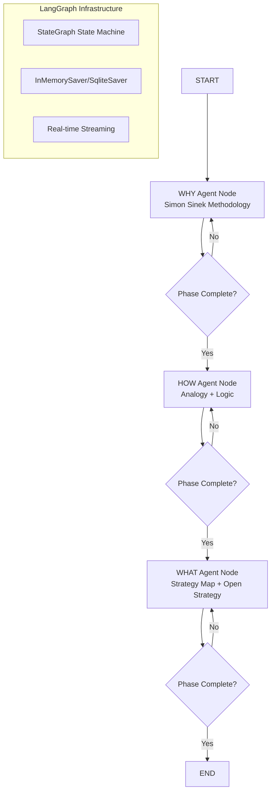

# **Product Requirements Document: AI Strategic Co-pilot (v2.0)**

## **1\. Introduction & Vision**

### **1.1. Vision**

To create an AI-powered strategic co-pilot that guides business leaders through a rigorous, Socratic, and sequential process of developing, refining, and testing their organizational strategy. The system will leverage a series of expert AI agents, each focused on a distinct phase of strategy development, to build a robust and logically sound strategic foundation.

### **1.2. Problem Statement**

Developing a clear and effective strategy is challenging. Leaders often rely on unstated assumptions, face cognitive biases, and struggle to connect high-level vision with day-to-day operations. Traditional strategy consulting is expensive and not always accessible.

### **1.3. Solution**

This product provides a guided, phased experience where the user collaborates with one specialist AI agent at a time. The user journey is broken down into three distinct phases—**WHY, HOW, and WHAT**—each managed by an agent with a research-backed methodology. This structured, linear progression ensures the user develops a complete and coherent strategy, moving from core purpose to actionable planning in a logical sequence.

## **2\. User Persona & Story**

* **Persona:** A Manager at a large corporation. They are business-savvy but not necessarily an expert in formal strategy frameworks. They are busy, results-oriented, and need to create a clear, defensible strategy to gain alignment and resources within their organization.  
* **User Story:** "As a Business Unit Manager, I want to use an interactive tool to guide my thinking through a step-by-step process so that I can transform my high-level ideas into a logically sound and well-structured strategy document that I can confidently share with my team and senior leadership."

## **3\. The User Journey: A Phased Approach**

The user's interaction with the coach is designed as a clear, sequential journey. The complexity of the underlying system is hidden, and the user is guided through one distinct phase of strategic thinking at a time before proceeding to the next.

1. **The "WHY" Phase:** The journey begins with the **WHY Agent**. The user engages in a focused dialogue to explore and articulate the core purpose of their strategy. The conversation continues until a clear "WHY Statement" is formulated and the user confirms they are ready to move on.  
2. **The "HOW" Phase:** Once the "Why" is established, the system transitions the user to the **HOW Agent(s)**. This phase leverages the **Analogy Agent** to find a causal model for success and the **Logic Agent** to structure the argument. The goal is to define the core methods and logic of the strategy.  
3. **The "WHAT" Phase:** After defining the "How," the user proceeds to the final phase with the **WHAT Agent(s)**. Here, the **Strategy Map Agent** helps formalize the specific details, and the **Open Strategy Agent** helps consider implementation and stakeholder engagement. This phase synthesizes all previous work into a complete, actionable plan.

## **4\. System Architecture & LangGraph-Native Workflow**

The system is built using **LangGraph's StateGraph** architecture, leveraging native LangGraph patterns for state management, agent coordination, and phase transitions.

### **4.1. LangGraph-Native Architecture**

1. **StateGraph**: The central state machine managing the WHY → HOW → WHAT progression
2. **Nodes**: Each specialist agent (WHY, HOW, WHAT) implemented as LangGraph nodes
3. **Conditional Edges**: Phase transitions handled via LangGraph conditional routing
4. **Built-in Checkpointing**: Session persistence using LangGraph's InMemorySaver/SqliteSaver
5. **Structured State**: TypedDict with reducers for proper state management

### **4.2. High-Level Workflow**

1. A user starts a new session with **thread_id** for LangGraph checkpointing
2. **StateGraph** routes messages to appropriate agent nodes based on `current_phase` state
3. Each **agent node** processes input and updates state with responses and completion status
4. **Conditional edges** check phase completion and route to next phase or continue current
5. **Built-in persistence** automatically saves state after each step via checkpointer
6. **Streaming support** enables real-time conversation updates
7. Final **strategy_map.json** generated when all phases complete

### **4.3. LangGraph System Diagram**



### **4.4. LangGraph State Management**

**State Schema:**
```python
class StrategyCoachState(TypedDict):
    messages: Annotated[list, add_messages]  # LangGraph message handling
    current_phase: str  # "WHY", "HOW", or "WHAT"
    why_output: Optional[WHYStatement]  # Structured output from WHY phase
    how_output: Optional[HOWStrategy]   # Structured output from HOW phase  
    what_output: Optional[WHATStrategy] # Structured output from WHAT phase
    phase_complete: bool  # Current phase completion status
    interaction_count: int  # Number of interactions in current phase
```

**Phase Transition Logic:**
* **Conditional Edge Functions:** LangGraph conditional edges check phase completion and route appropriately
* **Built-in State Updates:** Each node updates state using LangGraph's reducer pattern
* **Automatic Persistence:** LangGraph checkpointer handles all session persistence
* **Thread-based Sessions:** Each conversation uses unique `thread_id` for isolation

## **5\. Core Components & LangGraph Implementation**

### **5.1. StateGraph Architecture**

* **Role**: LangGraph StateGraph serves as the central state machine managing phase progression
* **Function**: Routes messages to agent nodes, manages state transitions via conditional edges, handles persistence via checkpointing
* **Benefits**: Built-in streaming, debugging, time-travel, human-in-the-loop capabilities

### **5.2. Agent Node Implementation**

Each specialist agent is implemented as a **LangGraph node function** that processes state and returns state updates. Agents leverage LangChain LLMs with structured output for methodology-specific coaching.

#### **Phase 1: WHY Agent Node**

* **Implementation**: LangGraph node function `why_agent_node(state: StrategyCoachState)`
* **Core Function**: Simon Sinek's "Start with Why" methodology implementation using structured LLM output
* **LangGraph Integration**: 
  - Receives `StrategyCoachState` with messages and phase context
  - Uses LangChain LLM with structured output schema (`WHYStatement`)
  - Returns state updates including new messages and completion status
* **Phase Completion**: Conditional edge function checks if WHY Statement is complete and user confirms readiness
* **Methodology**: The agent uses a Socratic, introspective process focused on uncovering the user's foundational beliefs. It does not invent a WHY; it helps the user discover the one that already exists by looking to the past.
    * **The Golden Circle**: The core framework used to structure the conversation, moving from the inside out: WHY, HOW, WHAT.
    * **Discovery, Not Invention**: The agent operates on the principle that an organization's WHY comes from its origin story, its moments of greatest pride, and the deeply held beliefs of its founders and leaders.
    * **Biology over Business**: The agent frames the importance of the WHY in the context of human decision-making, explaining that the WHY appeals to the limbic brain, which drives trust, loyalty, and behavior.
* **Coaching Workflow**: The agent follows a structured workflow designed to populate the **Target Output Structure** detailed below.
    1.  **Deconstruct the WHAT & HOW**: Establishes a baseline of the user's current thinking.
    2.  **Mine the Past for the WHY**: Asks probing questions to uncover the origin story and emotional drivers.
    3.  **Distill the WHY Statement**: Helps synthesize stories into a concise "To..." statement.
    4.  **Define the HOWs**: Guides the user to articulate their values as actionable verbs and core beliefs.
    5.  **Connect to the WHATs**: Helps the user connect their products/services as tangible proof of their WHY and synthesizes the final output.

---
* **Target Output Structure (Template)**

    ### **YOUR WHY STATEMENT:**
    To **[Core Action/Verb]** every **[Primary Beneficiary]** access to **[Key Resource/Tool]**, so they can **[Achieve Primary Goal]** without **[Common Obstacle/Pain Point]**.

    ---

    ### **CORE BELIEFS THAT DRIVE YOU:**
    - Every **[Primary Beneficiary]** deserves **[Core Advantage]**.
    - **[Primary Beneficiary]** shouldn't have to choose between **[Desirable Goal A]** and **[Undesirable Consequence B]**.
    - The right **[Tools/Systems/Support]** should amplify a **[Beneficiary's Strengths]**, not drain their **[Critical Personal Resource, e.g., energy, time]**.
    - People perform best when **[Ideal Condition #1, e.g., given real autonomy]**.
    - **[Broader Principle #1, e.g., Sustainable practices]** create better outcomes for everyone.
    - **[Core Value Metric, e.g., Merit and results]** matter more than **[Traditional Metric, e.g., size, credentials]**.

    ---

    ### **VALUES THAT GUIDE BEHAVIOR:**
    - **[Value 1 as an Actionable Verb Phrase]:** [Brief explanation of the value in action].
    - **[Value 2 as an Actionable Verb Phrase]:** [Brief explanation of the value in action].
    - **[Value 3 as an Actionable Verb Phrase]:** [Brief explanation of the value in action].
    - **[Value 4 as an Actionable Verb Phrase]:** [Brief explanation of the value in action].
    - **[Value 5 as an Actionable Verb Phrase]:** [Brief explanation of the value in action].
    - **[Value 6 as an Actionable Verb Phrase]:** [Brief explanation of the value in action].

    ---

    ### **GOLDEN CIRCLE INTEGRATION:**
    Your WHY creates a clear mission of **[Overarching Mission Theme]**: You exist to **[Your WHY Statement]** (PURPOSE), because you believe **[Summarized Core Beliefs]** (BELIEFS), which manifests in behaviors like **[List 2-3 Key Actionable Values]** (VALUES). This creates a business model where your own **[Internal Proof Point, e.g., operational excellence, company culture]** becomes proof that your approach works.

    ---

    ### **VALIDATION:**
    Does this capture the essence of why **[Your Company/Organization]** exists? Does it feel authentic to your daily reality of helping **[Primary Beneficiary]** achieve **[Key Outcome]**? Would this WHY inspire the right **[Customers/Clients]** to work with you and help your team make clear decisions about **[Key Business Decisions, e.g., which products to build]**?

    ---

    ### **TRANSITION TO HOW:**
    Now that we've clarified your WHY - **[Summarized WHY Statement]** - we can focus on HOW you'll deliver this.

---

#### **Phase 2: HOW Agent Node**

* **Implementation**: LangGraph node function `how_agent_node(state: StrategyCoachState)` 
* **Core Function**: Combines Carroll & Sørensen analogical reasoning with logical validation
* **LangGraph Integration**:
  - Accesses `why_output` from state for context continuity
  - Uses structured LLM output for `AnalogicalComparison` and `LogicalArgument`
  - Updates state with `how_output` containing strategic logic
* **Dual Methodology**: Integrates both Analogy and Logic agents as a unified node  
* **Methodology**: The agent facilitates a structured process to build and test a strategic analogy.  
  * **Source vs. Target**: The user's company is the target; the company it is compared to is the source.  
  * **Horizontal vs. Vertical Relations**: This is the critical distinction. The agent constantly pushes the user from **horizontal relations** (e.g., "Company A has feature X, and we have feature X") to **vertical relations** (the causal theory of *why* the source succeeded).  
  * **Positive & Negative Analogies**: The agent insists on analyzing both similarities (positive) and differences (negative) to avoid confirmation bias.  
* **Coaching Workflow**:  
  1. **Define Target & Conclusion**: Asks the user to state their company (target) and desired outcome (conclusion).  
  2. **Select a Source**: Instructs the user to identify a company (source) that has already achieved the desired conclusion.  
  3. **Decompose the Analogy (Horizontal)**: Prompts the user to list key similarities (positive analogies) and differences (negative analogies).  
  4. **Uncover Causal Theory (Vertical)**: Asks probing questions to force the user to articulate the source's theory of success.  
  5. **Apply & Test the Theory**: Guides the user to apply the source's causal theory to their own company, using the horizontal analogies.  
  6. **Formulate Strategy**: Helps the user synthesize the analysis into a unique, firm-specific theory of success.

##### **Logic Agent**

* **Core Function**: To ensure the user's strategy is a rigorously logical and defensible argument, based on the principles of deductive logic.  
* **Inputs**: Session state and the causal theory developed by the Analogy Agent.  
* **Outputs**: A logically sound strategic argument, connecting the "HOW" to the "WHY."

---

#### **Phase 3: WHAT Agent Node**

* **Implementation**: LangGraph node function `what_agent_node(state: StrategyCoachState)`
* **Core Function**: Synthesizes WHY and HOW outputs into actionable strategy using Kaplan & Norton + Open Strategy frameworks
* **LangGraph Integration**:
  - Accesses `why_output` and `how_output` from state for complete context
  - Uses structured LLM output for `StrategyMapPerspective` and `OpenStrategyPlan`
  - Generates final `strategy_map.json` as structured output
* **Unified Methodology**: Combines Strategy Map and Open Strategy approaches in single node  
* **Methodology**: The agent guides the user through the four perspectives of the strategy map, building a cause-and-effect story based on an "outside-in" logic:  
  1. **Stakeholder & Customer Perspective**: Clarifies the value proposition for key stakeholders, starting with the fundamental problem the organization solves for them.  
  2. **Internal Process Perspective**: Defines the critical processes the organization must excel at to deliver on its value proposition.  
  3. **Learning & Growth Perspective**: Identifies the intangible assets needed for the strategy (Human, Information, and Organization Capital).  
  4. **Value Creation Perspective**: Defines the ultimate strategic objectives by measuring the intended impact (increase, decrease, or transformation) on the **Six Value Components**:  
     * Financial Value  
     * Manufactured Value  
     * Intellectual Value  
     * Human Value  
     * Social & Relationship Value  
     * Natural Value

##### **Open Strategy Agent**

* **Core Function**: To act as an expert facilitator of **Open Strategy**. Its purpose is to guide the user in designing an inclusive, transparent, and collaborative process to validate, refine, and mobilize their strategy for successful implementation.  
* **Inputs**: The completed strategy map from the previous step.  
* **Outputs**: A strategy testing and implementation plan.  
* **Methodology**: The agent's framework is based on the principles of Open Strategy by Matzler, Hautz, et al. It focuses on changing the *process* of strategy to overcome bias, fuel innovation, and build deep organizational commitment.  
  * **The Problem with Closed Strategy**: The agent can explain the common "pathologies" of traditional strategy: becoming too similar to competitors (isomorphism), trapping good ideas in silos, and developing unpopular strategies that fail during implementation.  
  * **The Core Solution**: The agent advocates for actively involving a diverse group of actors (frontline employees, experts, customers, suppliers) in strategy deliberations.  
  * **Three Phases of Strategy**: The agent tailors its guidance based on whether the user is in the phase of **Idea Generation**, **Strategy Formulation**, or **Strategy Mobilization**.  
* **Coaching Workflow**:  
  1. **Define the Strategic Challenge & Phase**: The agent first asks the user to clarify their goal. ("What is the core strategic challenge you are facing? Are you trying to find new growth areas, or improve the implementation of your current strategy?")  
  2. **Identify Participants ("Who to Open Up To?")**: The agent helps the user determine the right mix of people. ("Who holds the knowledge you need? Should we involve internal frontline employees for operational knowledge, or external experts and customers to break free of industry logic?")  
  3. **Design the Engagement ("How to Open Up?")**: The agent helps select the right tool for the task. ("Do you need a broad, digital approach like a 'Strategy Jam' to gather many ideas, or a focused, in-person workshop like a 'Nightmare Competor Challenge' to develop disruptive business models?")  
  4. **Frame the Core Question**: The agent helps craft a powerful question to pose to the group. ("For idea generation, it could be open: 'What should our company look like in 2030?' For disruption, it could be provocative: 'If you were to create a startup to destroy our business, what would it be?'")  
  5. **Plan for Synthesis and Feedback**: The agent ensures the process is well-managed. ("How will you manage and synthesize the contributions? Crucially, how will you provide feedback to participants so they know their contribution was valued?")

## **6\. Final Output**

The primary deliverable remains a structured **JSON object** (strategy\_map.json) that is built incrementally and finalized during the "WHAT" phase, representing the complete strategy.

## **7\. LangGraph-Native Technical Implementation**

### **7.1. Core LangGraph Components**

**StateGraph Structure:**
```python
from langgraph.graph import StateGraph, START, END
from langgraph.checkpoint.memory import InMemorySaver
from langgraph.graph.message import add_messages

# Build the strategy coaching graph
graph_builder = StateGraph(StrategyCoachState)

# Add agent nodes
graph_builder.add_node("why_agent", why_agent_node)
graph_builder.add_node("how_agent", how_agent_node) 
graph_builder.add_node("what_agent", what_agent_node)

# Add conditional routing edges
graph_builder.add_edge(START, "why_agent")
graph_builder.add_conditional_edges("why_agent", route_phase_transition)
graph_builder.add_conditional_edges("how_agent", route_phase_transition)
graph_builder.add_conditional_edges("what_agent", route_phase_transition)

# Compile with checkpointer for persistence
memory = InMemorySaver()  # Use SqliteSaver for production
graph = graph_builder.compile(checkpointer=memory)
```

**Agent Node Pattern:**
```python
def why_agent_node(state: StrategyCoachState):
    """WHY phase agent node using Simon Sinek methodology."""
    # Use LangChain LLM with structured output
    why_llm = llm.with_structured_output(WHYStatement)
    
    # Process conversation with methodology-specific prompts
    response = why_llm.invoke(state["messages"])
    
    # Update state with new message and phase data
    return {
        "messages": [AIMessage(content=response.content)],
        "why_output": response if response.is_complete else state.get("why_output"),
        "phase_complete": check_why_completion(state, response),
        "interaction_count": state["interaction_count"] + 1
    }
```

### **7.2. LangSmith Tracing Integration**

All LangGraph interactions must be traced with LangSmith for observability, debugging, and monitoring:

**Environment Configuration:**
```bash
LANGSMITH_TRACING="true"
LANGSMITH_ENDPOINT="https://api.smith.langchain.com"
LANGSMITH_API_KEY="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"
LANGSMITH_PROJECT="strategy-coach"
```

**Setup Steps:**
1. Install dependencies: `pip install -U langsmith`
2. Configure environment variables in `.env` file
3. Run LangGraph application - traces automatically sent to LangSmith project
4. Monitor interactions at https://smith.langchain.com

**Tracing Requirements:**
* **All Agent Interactions**: Every WHY/HOW/WHAT agent node execution traced
* **State Transitions**: Phase transitions and conditional edge routing logged
* **LLM Calls**: All structured output generation and conversation processing traced
* **User Sessions**: Complete user journeys from WHY through WHAT tracked
* **Error Monitoring**: Failed API calls and exceptions captured for debugging
* **Performance Metrics**: Response times and token usage monitored

### **7.3. LangGraph Benefits Utilized**

* **Built-in Checkpointing**: Session persistence with thread_id isolation
* **Streaming**: Real-time conversation updates via `graph.stream()`
* **State Management**: Proper TypedDict with reducers for message handling
* **Conditional Routing**: Native phase transition logic via conditional edges
* **LangSmith Integration**: Automatic tracing of all LLM calls and state transitions
* **Human-in-the-Loop**: Built-in support for interrupts and manual interventions
* **Time Travel**: Ability to replay and branch from any checkpoint

### **7.3. Key Implementation Files**

* `src/core/graph.py`: Main StateGraph implementation and compilation
* `src/agents/why_agent.py`: WHY phase node function and completion logic
* `src/agents/how_agent.py`: HOW phase node function (analogy + logic)
* `src/agents/what_agent.py`: WHAT phase node function (strategy map + open strategy)
* `src/core/state.py`: StrategyCoachState TypedDict and reducer functions
* `src/api/endpoints.py`: FastAPI endpoints wrapping graph.stream() and graph.invoke()


## **8\. Success Metrics**

* **Phase Completion Rate:** Percentage of users who successfully complete all three phases (WHY, HOW, WHAT).  
* **Logical Flow:** The system successfully guides users through the phased journey without logical dead-ends or confusing transitions.  
* **Methodological Fidelity:** The coaching logic in each phase remains faithful to the principles outlined in the agent profiles.  
* **Final Output Quality:** The final JSON output is well-structured and contains all necessary elements to describe the strategy.

## **9\. User Interface (Web Application)**

The UI design remains highly relevant, especially the progress tracker, which now perfectly aligns with the system's core logic. The JavaScript will be updated to handle the current\_phase returned by the API to update the UI components.

*(The HTML structure from the original PRD remains the same. The JavaScript logic in strategyCoach() should be adapted to send confirmation triggers and update the UI based on the current\_phase from the API response.)*

## **10\. Progress Feedback & Strategic Completeness**

This concept is now central to the user experience.

* **Phase Milestones**: The transitions between WHY, HOW, and WHAT are the primary progress milestones.  
* **Visual Feedback**: The UI's progress tracker should be the single source of truth for the user to understand where they are in the process.  
* **Phase Transition Ceremonies**: When a phase is completed, the AI's language should clearly signify the transition. For example: "Excellent. We've established a solid foundation with your WHY. Now, let's transition to *how* you can bring that purpose to life."

## **11\. Multi-Model LLM Support**

The system can be configured to use various LLM providers (like Mistral, OpenAI, Anthropic, Google) for the agent functions, allowing for flexibility and cost optimization. This is independent of the state machine architecture.

## **12\. LangGraph-Native Testing Strategy**

Testing leverages LangGraph's built-in testing capabilities and checkpointing system for comprehensive validation.

### **12.1. LangGraph Testing Approach**

* **Direct Graph Testing**: Test StateGraph directly using `graph.invoke()` with test states
* **Checkpoint Testing**: Verify state persistence and resumption using checkpointer
* **Node Testing**: Unit test individual agent node functions in isolation
* **Edge Testing**: Test conditional edge routing logic and phase transitions
* **End-to-End Testing**: Playwright browser testing with LangGraph streaming integration

### **12.1. Executive Summary**

**Vision**: Create a simple, reliable testing agent that uses Playwright to directly control the browser and simulate realistic user interactions with the strategic coaching system.

**Approach**: 
- Use a business case described in a markdown file as the input and inspiration for generating test user responses (eg see: `testing/business-cases/business-case-for-testing.md` - AFAS Software case study)
- Start API server programmatically
- Open browser and navigate to application
- Testing agent writes responses directly via browser interface
- Record each interaction in JSON file
- Take screenshots every 5th interaction
- Generate beautiful Markdown test report with embedded screenshots

**Business Case Context**: The testing agent will simulate a **Visionary Founder persona** based on the AFAS Software case study (€324.6M enterprise, family-owned Dutch software company with exceptional culture-first approach). This provides realistic context for testing all three strategy phases:
- **WHY**: Mission to "inspire better entrepreneurship" through culture and trust
- **HOW**: Integrated product philosophy + hyper-focused market strategy + culture-first approach
- **WHAT**: Strategy map with four-day workweek initiative, AFAS Focus platform, and social responsibility integration

### **12.2. LangGraph-Native Test Workflow**

1. **Unit Tests**: Test individual node functions with mock StrategyCoachState
2. **Graph Tests**: Test complete graph execution with `graph.invoke(test_state)`
3. **Checkpoint Tests**: Verify state persistence using `graph.get_state()` and `graph.get_state_history()`
4. **Streaming Tests**: Test real-time updates via `graph.stream()` 
5. **Browser E2E**: Playwright tests interacting with FastAPI endpoints that wrap LangGraph
6. **LangSmith Validation**: Verify all interactions are properly traced

### **12.3. Revised Markdown Report Format**

Markdown

\# AFAS Software Strategic Coaching Journey Test Report

\#\# Test Summary  
\- **\*\*Business Case\*\***: AFAS Software (€324.6M enterprise)  
\- **\*\*Persona\*\***: Visionary Founder  
\- **\*\*Total Interactions\*\***: 30  
\- **\*\*Success\*\***: ✅ Completed successfully

\#\# Journey Progression

\#\#\# Phase 1: WHY (Interactions 1-10)  
*\*Successfully identified core purpose.\**  
\!\[Screenshot 1\](screenshots/why\_phase\_complete.png)

\#\#\# Phase 2: HOW (Interactions 11-20)  
*\*Successfully defined the strategic approach.\**  
\!\[Screenshot 2\](screenshots/how\_phase\_complete.png)

\#\#\# Phase 3: WHAT (Interactions 21-30)  
*\*Successfully generated the final strategy map.\**  
\!\[Screenshot 3\](screenshots/what\_phase\_complete.png)

## **13\. Deployment & Operations**

* **Infrastructure**: The application will be containerized using Docker for portability.  
* **Deployment**: Deployed on a cloud platform (e.g., Google Cloud Run, AWS Fargate) for scalable, serverless execution.  
* **Session Storage**: Production deployments will use a persistent, scalable storage solution like Redis or a managed database for session state instead of the in-memory dictionary.  
* **Monitoring**: Logging and monitoring will be set up to track API performance, error rates, and conversation quality for continuous improvement.

## **14\. Non-Goals (Out of Scope)**

* The coach will **not** provide its own business advice or opinions.  
* The coach will **not** perform external data gathering or market analysis.  
* The coach will **not** generate financial models or projections.  
* Future concepts like pluggable research agents or a "Board of Directors" feedback feature are explicitly out of scope.